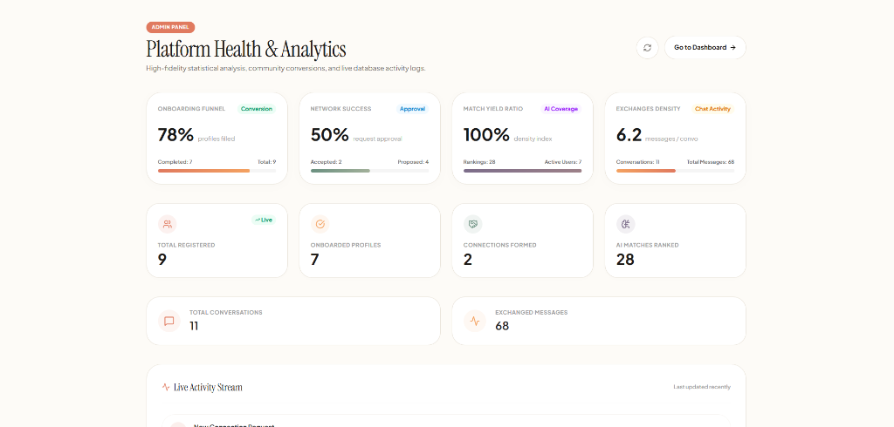

# Synq.ai — Warm Minimalist AI-Native Community Hub

[](https://synq-ai-ten.vercel.app/)
[](https://nextjs.org)
[](https://tailwindcss.com)
[](https://prisma.io)

**Synq** is a premium, high-fidelity AI-native networking community engineered for builders, creators, developers, and designers. Crafted around a warm, soft-minimalist editorial bento grid aesthetic, Synq centers human connection, tactile typography, and visual tranquility, moving far away from cold, hyper-futuristic dark mode styles.

Explore the full platform live on Vercel: **[https://synq-ai-ten.vercel.app/](https://synq-ai-ten.vercel.app/)**

---

## 🎨 Design Philosophy & Aesthetic Tokens

Synq is built around a bespoke, high-end editorial design system tailored to evoke calmness, texture, and premium brand aesthetics:

*   **Warm Minimalism Layout**: A customized Bento UI grid utilizing smooth corners, soft borders, and generous breathing room.
*   **Aesthetic Palette (60-30-10 Rule)**:
    *   **60% (Base)**: Oatmeal Milk (`#FDFBF7`) — provides a tactile, paper-like background experience that feels incredibly premium.
    *   **30% (Secondary)**: Charcoal Slate (`#1E1A17` & `#7E756C`) — expressive, high-contrast dark tones that ensure flawless legibility and accessibility.
    *   **10% (Citrus Accent)**: Sunwashed Clay (`#E07A5F`) & Apricot Citrus (`#F4A261`) — energetic, natural warmth highlighting active controls and interactive states.
*   **Expressive Serif Typography**: Paired **Instrument Serif** for display headings with Plus Jakarta Sans for clean geometric layouts and micro-copy.

---

## 🚀 Interactive Platform Walkthrough & Features

### 1. 📋 Multi-Step Editorial Onboarding Wizard
To deliver a smooth and captivating first impression, new users are guided through an interactive, multi-step onboarding wizard:
- **8 Form Steps**:
  1. **Identity**: Profile Name, current Role, and Organization.
  2. **Gender Representation**: Support for `Male`, `Female`, `Non-Binary`, and `Prefer Not To Say` with full public privacy gating (gender is entirely hidden if "Prefer Not To Say" or unset).
  3. **Skills**: Searchable profile skill badges.
  4. **Interests**: Collaborative interest lists.
  5. **Projects**: In-depth description of current projects and creations.
  6. **Goals**: Specific target milestones.
  7. **Looking For**: Details on target co-founders, partners, or advisors.
  8. **Profile Review**: Final screen reviewing all submitted fields before AI processing.
- **Dynamic Wizard Interactions**: Leverages `framer-motion` slide transitions, dynamic progress indicators, and active pulse rings for premium tactile feedback.

### 2. 🔍 Unified Discover & Exploration Hub (`/dashboard/discover`)
Discover acts as the primary hub for networking and matchmaking. It merges exploration, search, and dynamic feeds:
1. **Recommended For You (AI-Gated Carousel)**: Calculates and displays matches with compatibility score rings and detailed Mistral AI explanations.
2. **Recently Joined (Community Freshmen)**: A horizontal carousel displaying the newest members with quick connection actions.
3. **Explore Everyone**: Bento grid listing all community builders.
4. **Live Query Search & Filtering**: Fast, client-side input with filters by Role, Skill, and Interest, and dynamic sorting (Alphabetical, Compatibility, Newest).

### 3. 💬 Secure Gated Direct Messaging (`/dashboard/messages`)
- **Exclusive Privacy Gating**: Chats are strictly gated and only available to builders with an approved (`ACCEPTED`) connection status.
- **State-of-the-Art Messaging UI**: Features a fluid chat dashboard with active conversation lists, real-time message streams, smooth animations, and unread indicators.

### 4. 🤖 Synq AI Assistant & Strict Security Policies
- **Intelligent Networking Assistant**: Conversational copilot powered by Mistral AI, helping users discover builders and compose connection prompts.
- **Strict Information Disclosure Safeguards**: The assistant acts exclusively as a networking assistant. It is structurally blocked from revealing infrastructure details:
  - *Database queries:* Returns: `"Synq uses secure modern infrastructure to support user profiles, networking and recommendations. I can't provide internal platform details."`
  - *Breach/Hack queries:* Returns: `"I can't speculate about security incidents or internal systems. My role is helping you discover and connect with relevant people."`
  - Restricted context prevents leakage of environment variables, APIs, system settings, or table schemas.

### 5. 📊 Premium Administrator Panel (`/admin`)

Our administrative suite is designed to give an absolute overview of the platform's vital signs and dynamic interaction telemetry.

#### 🖥️ Dashboard Interface


- **Advanced Platform KPI Analytics**: Real-time analytical statistics displaying Onboarding Funnel Completion rates, Connection Approval Success percentages, Match Recommendations coverage, and Message density logs.
- **Live Stream Feed**: Chronological transaction stream tracking signups, connection changes, and chat session creation.

#### 🛡️ Role-Based Access Control (RBAC) & Dynamic Authorization
Access to the administrator dashboard is strictly protected at the route and server-actions level.
- **Authorized Email Address**: Gated dynamically by email identity matching and role configurations. The active administrator email is securely loaded from environmental variables (refer to `.env.example` for details).
- **No Hardcoded Password**: Authorization is identity-driven and verified through Supabase session matching. The administrator signs up and logs in normally using their standard email and password.
- **Cascading Access Evaluation (`checkIsAdmin()`)**:
  1. Checks if the logged-in user's email matches the authorized `ADMIN_EMAIL` env variable.
  2. Fallback: Checks if the user's Profile record in the database has its `role` explicitly containing `"admin"`.

#### 🧪 Interactive Sandbox Mode for Reviewers
For the convenience of assessors and recruiters reviewing the codebase:
- **Sandbox Bypass**: Visiting `/admin` displays a secure **Bypass / Enter Sandbox Mode** button. Clicking this button activates sandbox mode, allowing you to preview and evaluate the interactive Platform Health metrics and Live Transaction feeds without needing to sign up or seed custom accounts.

---

## 🛠️ Complete Technology Stack

- **Frontend Core**: Next.js 16.2.6 (App Router, Turbopack, React Server Components)
- **Styling & Theme**: Tailwind CSS & custom CSS properties.
- **Database & Schema**: Prisma ORM with PostgreSQL database engine.
- **Authentication**: Supabase Auth (Cookie-based session management, NextAuth-compatible architecture)
- **Transactional Email**: Resend SMTP Infrastructure for welcome templates.
- **LLM Engine**: Mistral AI Node API client.

---

## ⚙️ Local Development & Setup

### 1. Clone the Codebase
```bash
git clone https://github.com/Syedzayed/Synq.ai.git
cd Synq
npm install
```

### 2. Configure Environment Variables
Create a `.env` file in the root directory based on the following variables:
```env
NEXT_PUBLIC_SUPABASE_URL=your_supabase_project_url
NEXT_PUBLIC_SUPABASE_PUBLISHABLE_KEY=your_supabase_publishable_key
DATABASE_URL=postgresql://...
DIRECT_URL=postgresql://...
MISTRAL_API_KEY=your_mistral_api_key
NEXTAUTH_SECRET=your_auth_secret
RESEND_API_KEY=your_resend_api_key
RESEND_FROM_EMAIL=noreply@yourdomain.com

# Dynamic Admin Credentials (optional, defaults provided)
ADMIN_EMAIL=admin@example.com
NEXT_PUBLIC_ADMIN_EMAIL=admin@example.com
```

### 3. Generate Database Client & Sync Schema
```bash
npx prisma generate
npx prisma db push
```

### 4. Run Development Server
```bash
npm run dev
```
Open [http://localhost:3000](http://localhost:3000) on your local browser.

### 5. Build for Production
```bash
npm run build
```

---

## 🛡️ Security & Performance Safeguards

* **Server Actions Validation**: Double-layered authorization checks safeguarding administrative actions and data retrieval server-side.
* **Rate-Limiter Protection**: Strict IP-based request rate limiting protecting register and login forms from brute force attacks.
* **Safe Client Hydration**: Complete decoupling of heavy database imports from Client Components to prevent database bundles from entering browser assets.
* **Bypass Safe Sandbox Modes**: Secure local routing to ensure assessment/demo logins operate instantly without forced email verification.

---

## 🔑 Authentication Notes & Production Recommendations

### 1. ⚙️ Assessment & Demo Mode
For the purpose of quick, frictionless evaluation during assessment and demo trials:
* **Email Verification Disabled**: Mandatory Supabase sign-up email confirmation has been intentionally deactivated. Registered users are immediately routed to log in and proceed through onboarding without email friction.
* **Welcome Emails**: Programmatic welcome emails are automatically triggered via the Resend API on successful profile creation, processed as a non-blocking background task (failures will never disrupt registration).
* **Password Reset delivery**: The complete recovery flow (`/forgot-password` and `/reset-password`) is fully implemented. Users can submit reset prompts and secure new passwords securely.
* **Resend Sandbox constraints**: Since the demonstration utilizes a Resend sandbox account, password reset emails and welcome notes can only be delivered to verified sandbox recipient addresses (e.g. the account owner's email).

### 2. 🛡️ Live Production Recommendations
When migrating the Synq platform into a live production environment, we highly recommend applying the following security measures:
* **Enable Email Verification**: Turn the "Confirm Email" toggle back to **ON** inside the Supabase Auth Project Settings panel.
* **Verify Custom Domain**: Fully verify your sending domain (e.g., `synq.ai` or your own domain) by completing the DKIM/SPF setup in your [Resend Domains Dashboard](https://resend.com/domains).
* **Configure Custom SMTP**: Apply the custom Resend SMTP relay settings (port `465` / secure SSL) inside the Supabase Project Dashboard under custom SMTP parameters (see detailed credentials in `docs/supabase-resend-smtp.md`).
* **Configure Production Callback URLs**: Ensure the redirect list in Supabase is updated to strictly permit your live production URLs (`https://synq-ai-ten.vercel.app/auth/callback`) to protect credentials transfer.
